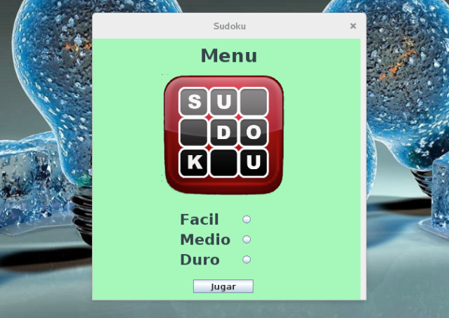
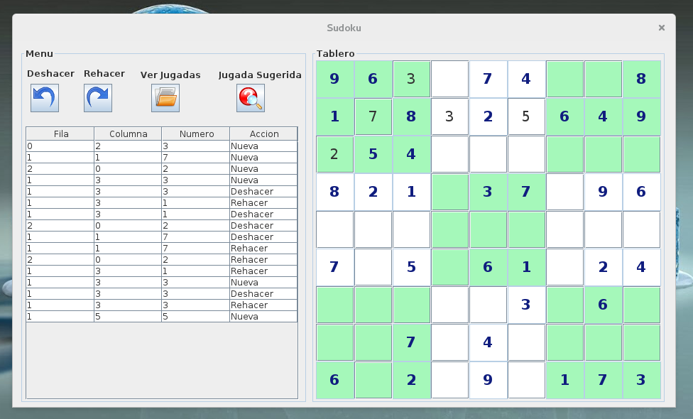

El Sudoku se presenta como una tabla de 9×9, compuesta por subtablas de 3×3 denominadas "regiones". Al inicio del juego algunas celdas pueden contener números. El objetivo es rellenar las celdas vacías con un número en cada una de ellas, de tal forma que cada fila, columna y región contenga los números de 1 a 9 sólo una vez.

#### Screenshots

